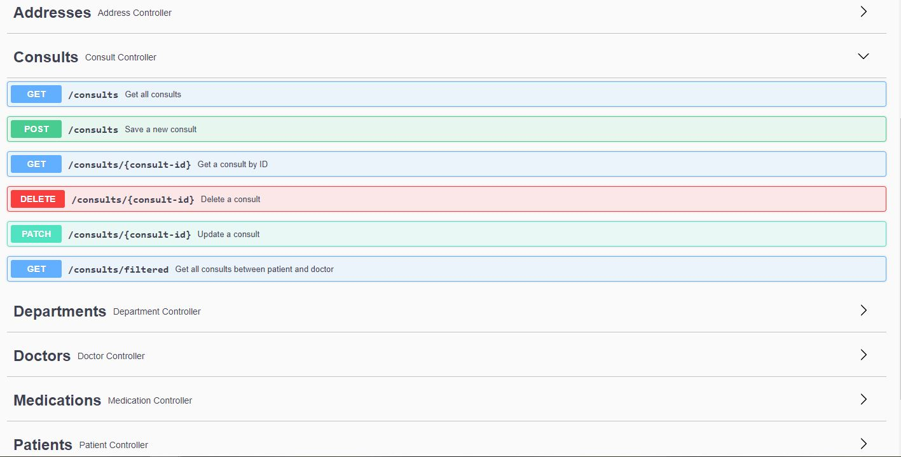

# Spring boot project

## REST-API controller for managing hospitalized patients

### Entities

1. Department - departments of an hospital
2. Doctor - doctors that are working in a certain department
3. Patient - patients hospitalized in a certain department
4. Address - each patient has an unique address
5. Consult - consultation between patient and doctor
6. Medication - medications that can be prescribed in a consult

### Diagram


### Features

1. Create for all entities
2. Get for all entities
3. Get by ID for all entities
4. Save for all entities
5. Update for all entities
6. Delete for all entities
7. Get all consults between patient and doctor
8. Get all doctors in a department
9. Get all patients in a department
1. Get all consultations for a doctor
1. Get all consultations for a patient
1. Get all medications administrated to a patient
1. Get the longest hospitalized patient

### Technologies and libraries

1. Spring boot
2. Hibernate
3. JPA
4. Maven
5. Mapstruct
6. Lombok
7. Mockito

### Backend logic

1. Spring Boot Beans (```@RestController```, ```@Service```, ```@Repository```, ```@Autowired```, ```@Mock``` etc)
2. All the relationships between entities (```@OneToOne```, ```@OneToMany```, ```@ManyToOne```, ```@ManyToMany```) using
   Foreign keys (```@JoinColumn(name = "FK_DOCTOR_ID")```)
3. POJO validation (request objects and DB objects) using custom annotations (```@ValidDoctor```) and field
   validations (```@Length(min = 2, message = "Custom message")```)
4. DTO objects for exposing the data (```@PatientDto```). Mapstruct mappers were used in order to map the entities to
   DTO objects
5. JPQL queries (```@Query(...)```)
6. Controller exception handling (```@ControllerAdvice````)

### Running the application

Before running the app, you have to execute the following command in order to generate the ```mapstruct``` mapping
methods
<br>
```mvn clean install -DskipTests```
<br>

### Documentation

For using the application, the requests can be executed via ```swagger``` by going to the following ```URL```:
<br>
```http://localhost:8080/swagger-ui/#/```
<br>



### Testing

Created ```unit tests``` for the ```services methods```. Totally there are ```57 unit tests```, all of them passing
successfully with an average of ```80% line coverage``` (because sonarLint still has some bugs, otherwise the coverage
would be 100%).
<br>
Created ```10 integration tests``` for ```Consult Controller``` which has ```100% coverage```. At the project level, the
line coverage is about ```37%```
<br>
Tests can be run via IntelliJ interface or using the following command:
<br>
```mvn test```
<br>
